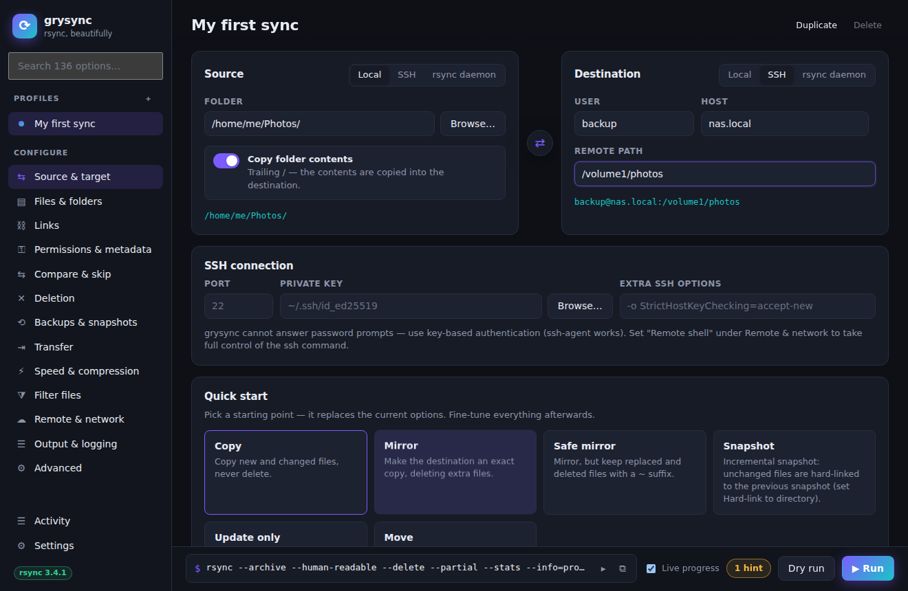
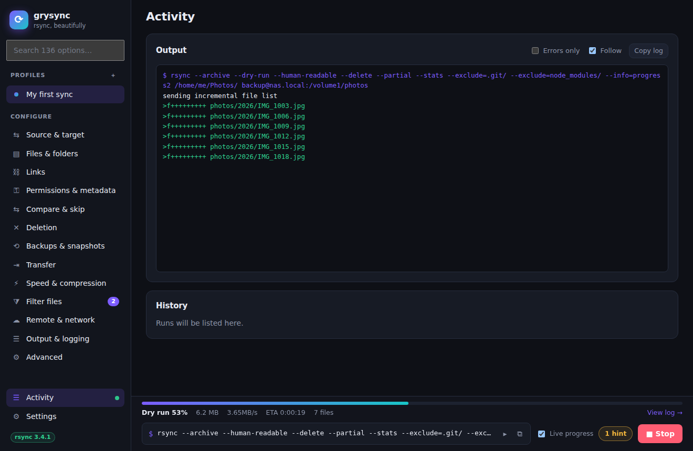
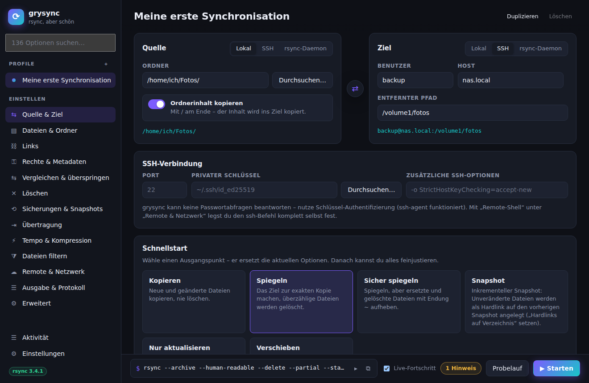

<p align="center">
  
</p>

<h1 align="center">grysync</h1>

<p align="center">
  <b>A modern, fast, cross-platform GUI for rsync, covering every option.</b><br>
  Built with Rust + <a href="https://v2.tauri.app">Tauri 2</a> and Svelte 5. Runs on Linux, macOS and Windows.
</p>



## Features

- **Every rsync option.** 136 options in 13 categories, each with an explanation, its flag and the minimum rsync version it needs. Search finds any of them instantly.
- **Live command preview.** Shows the exact `rsync` command as you edit, ready to copy into a script or cron job.
- **Local, SSH and rsync-daemon endpoints**, with port, key and extra SSH options. A switch for the trailing slash makes clear whether the folder or only its contents are copied.
- **Quick-start presets.** Copy, Mirror, Safe mirror, Snapshot (`--link-dest`), Update only and Move.
- **Filter rule editor.** Ordered include/exclude/raw filter rules with one-click excludes for `.git/`, `node_modules/` and similar.
- **Live progress.** Overall percentage, throughput, ETA and file count, parsed from `--info=progress2`.
- **Streaming log** with colour for itemized changes, deletions and errors, plus a run history with exit-code explanations.
- **Safety net.** Checks for conflicting options, options your rsync does not support and missing endpoints. Runs that delete files ask for confirmation first and offer a dry run.
- **Profiles.** Save as many sync jobs as you like. They are stored as JSON in your config directory.
- **English and German.** The UI follows the system language and can be switched under **Settings**. Search works in both languages.
- **Fast and small.** A native Rust backend starts rsync directly, with no shell in between, so there are no quoting or injection problems. Dark and light themes are included.



## Requirements

grysync is a front end: it needs `rsync` installed.

| OS | rsync |
| --- | --- |
| Linux | `sudo apt install rsync` / `dnf install rsync` / `pacman -S rsync` |
| macOS | macOS 15+ ships *openrsync*, which lacks many options. Use `brew install rsync` |
| Windows | [cwRsync](https://itefix.net/cwrsync) or rsync from MSYS2 / Git for Windows. Set its path under **Settings** |

For SSH transfers, use key-based authentication (ssh-agent works). grysync cannot answer interactive password prompts.

## Download

Prebuilt installers (`.deb`, `.rpm`, `.AppImage`, `.dmg`, `.msi`, `.exe`) are attached to each [release](https://github.com/kennerblick/grysync/releases).

## Build from source

Prerequisites: [Rust](https://rustup.rs), Node.js 20+, and the [Tauri system dependencies](https://v2.tauri.app/start/prerequisites/) for your OS (on Debian/Ubuntu: `libwebkit2gtk-4.1-dev libayatana-appindicator3-dev librsvg2-dev libxdo-dev`).

```sh
git clone https://github.com/kennerblick/grysync
cd grysync
npm install
npm run tauri dev      # run in development mode
npm run tauri build    # build installers into src-tauri/target/release/bundle
```

`npm run dev` also serves the UI in a normal browser, using a simulated rsync. This is useful for UI work.

### Tests

```sh
npm run check && npm test            # type check + frontend unit tests
cd src-tauri && cargo test           # backend tests (run real rsync if installed)
```

### Adding a language

Copy `src/lib/locales/de.ts` and `options.de.ts`, translate them and register the language in `src/lib/locales/index.ts`. The type checker and `locales.test.ts` report missing keys.

## Project layout

```
src/                     Svelte frontend
  lib/options.ts         catalogue of all rsync options
  lib/args.ts            profile → argument vector, validation, exit codes
  lib/store.svelte.ts    app state, persistence, run control
  lib/locales/           UI translations (en.ts is the reference, de.ts,
                         options.de.ts for the option catalogue)
  lib/components/        UI components
src-tauri/src/
  runner.rs              spawns rsync, streams output, cancellation
  progress.rs            parser for --progress / --info=progress2 lines
  rsync.rs               rsync detection and version parsing
  store.rs               JSON persistence in the config directory
```

## Releasing

Push a tag like `v0.1.0`. The *Release* workflow builds installers for Linux (x64 + arm64), macOS (universal) and Windows, and attaches them to a draft GitHub release.

## Deutsch (Kurzfassung)

grysync ist eine moderne grafische Oberfläche für rsync. Sie deckt alle Optionen ab, zeigt live den erzeugten Befehl und den Fortschritt, bietet Profile und Filterregeln und warnt vor gefährlichen Kombinationen. Sie läuft unter Linux, macOS und Windows. Voraussetzung ist ein installiertes `rsync`.

Die Oberfläche gibt es auf Deutsch und Englisch. Sie richtet sich nach der Systemsprache und lässt sich unter **Einstellungen → Darstellung → Sprache** umstellen.



## License

[MIT](LICENSE). rsync itself is GPL-licensed and is not bundled; grysync runs the rsync already installed on your system.
